# 🎨 AI应用流程图集合

本文档包含项目中AI应用的所有关键流程图，使用Mermaid格式。

---

## 1. AI整体架构图（简洁版）

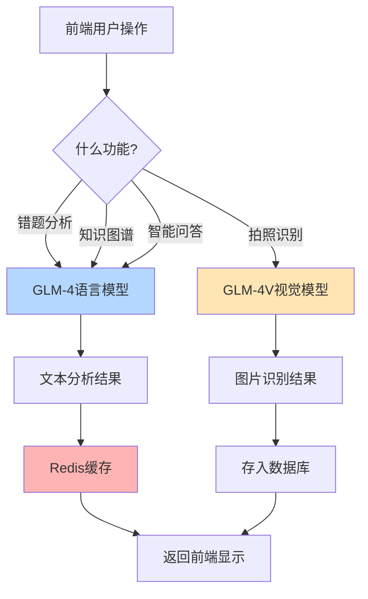

---

## 2. 错题AI分析完整流程

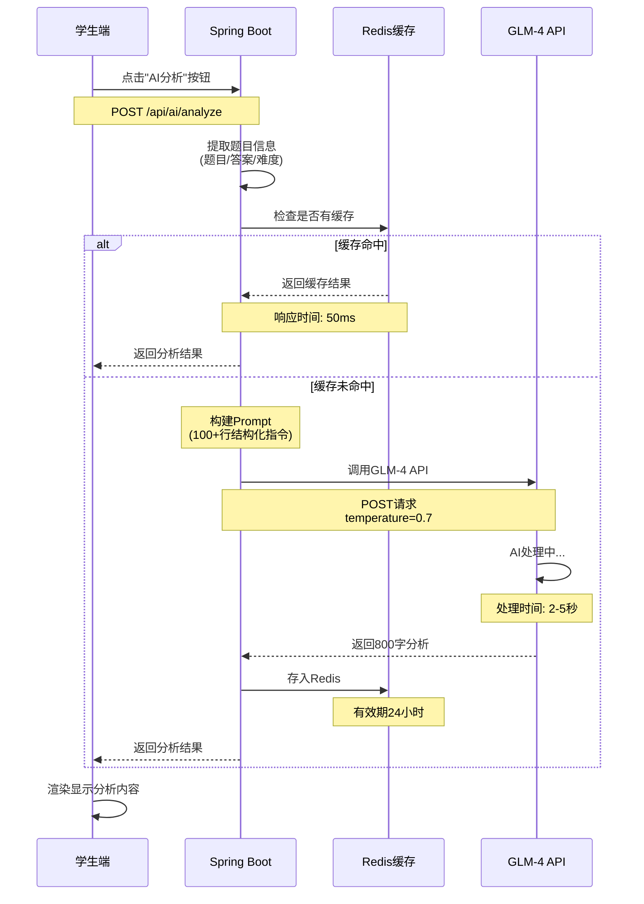

---

## 3. Prompt工程核心流程

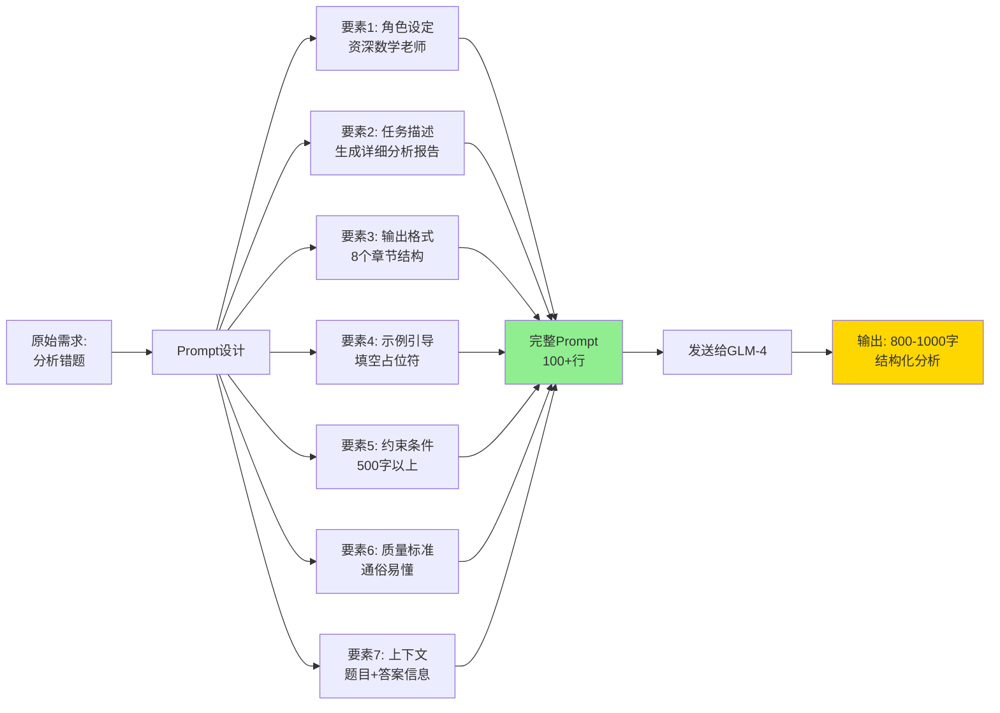

---

## 4. GLM-4V图片识别流程

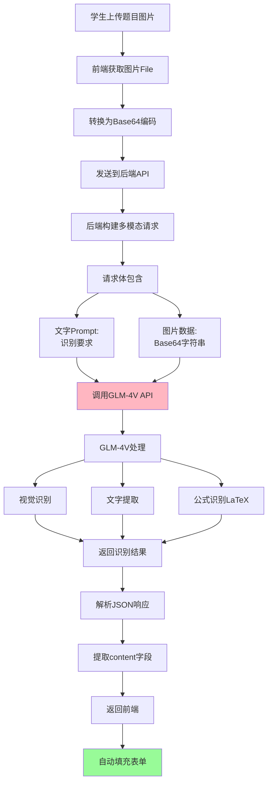

---

## 5. 知识图谱生成流程

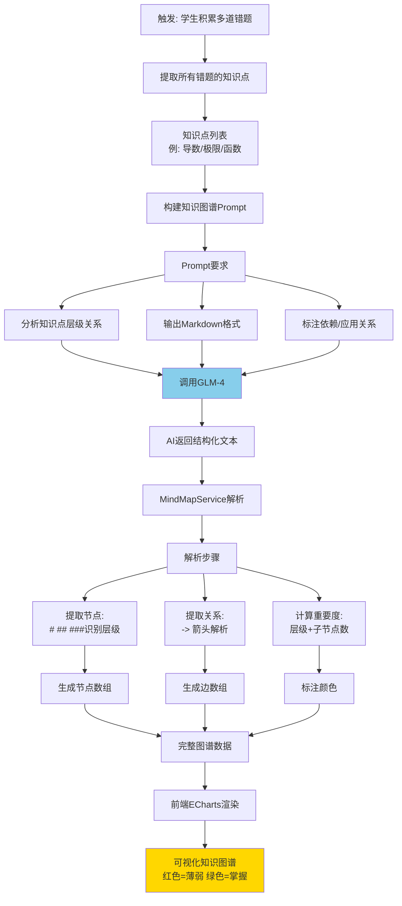

---

## 6. AI参数调优决策树

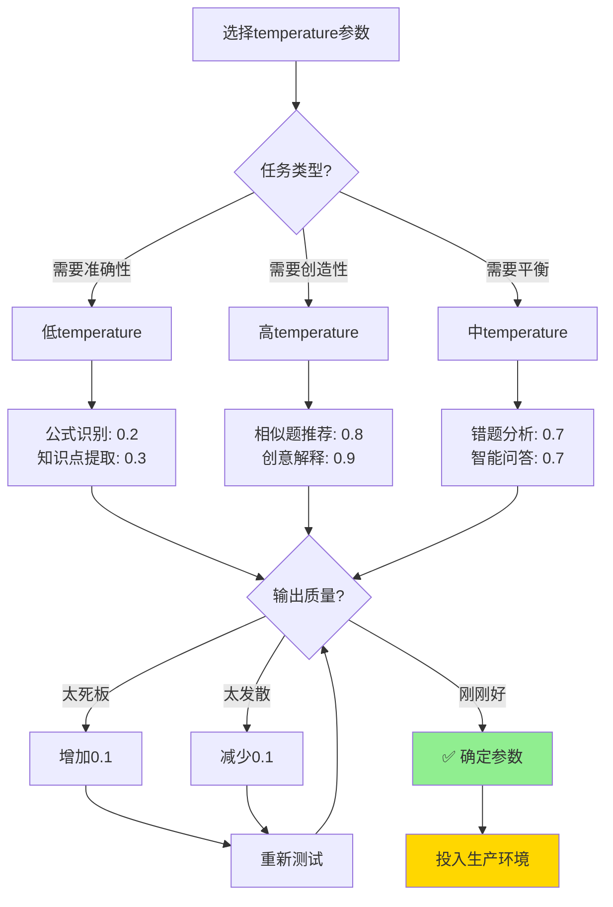

---

## 7. Redis缓存策略流程

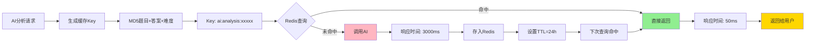

---

## 8. AI错误处理与降级流程

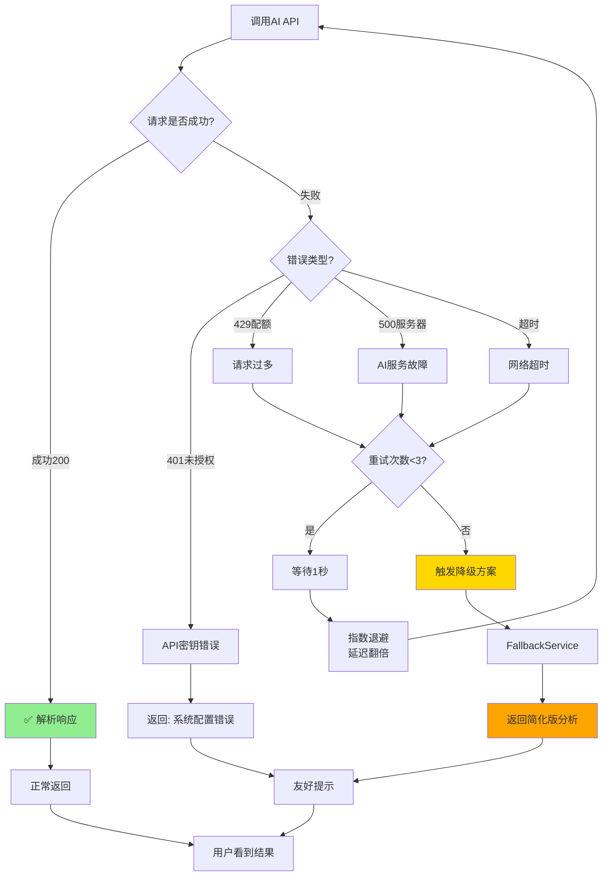

---

## 9. 双模型协同工作流程

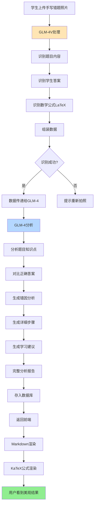

---

## 10. AI成本优化流程

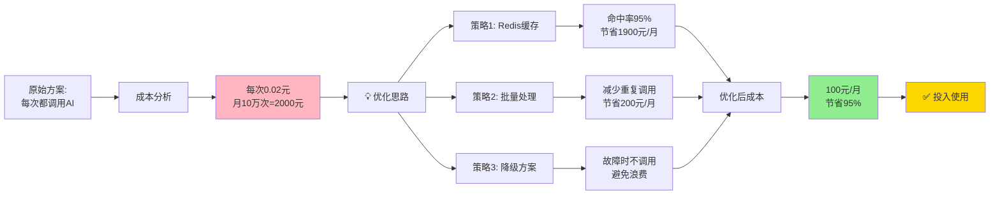

---

## 11. 学生使用AI功能的完整旅程

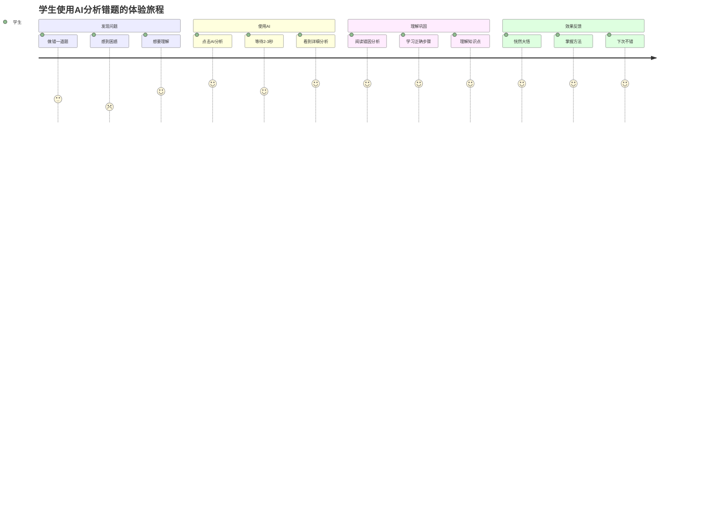

---

## 12. Prompt迭代优化历程

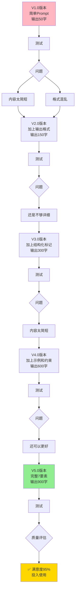

---

## 使用说明

### 如何在Markdown中嵌入这些图表？

1. **复制对应的mermaid代码块**
2. **粘贴到支持Mermaid的平台**：
   - GitHub README
   - Typora编辑器
   - VS Code + Markdown Preview Enhanced
   - 在线工具: https://mermaid.live/

### 如何在PPT中使用？

1. 访问 https://mermaid.live/
2. 粘贴mermaid代码
3. 点击"PNG"或"SVG"导出图片
4. 插入到PPT中

### 颜色说明

- 🟢 **绿色** - 成功/最终结果/推荐方案
- 🔵 **蓝色** - GLM-4语言模型相关
- 🟡 **黄色** - 重要节点/用户看到的结果
- 🔴 **红色** - 缓存/存储相关
- 🟠 **橙色** - GLM-4V视觉模型相关
- 🟣 **紫色** - 备选方案

---

## 答辩时如何使用这些图？

### 图1-2：整体介绍
> "这是我们AI的整体架构和主流程，采用双模型设计..."

### 图3：技术深度
> "这张图展示了我们Prompt Engineering的核心技术..."

### 图5：创新点
> "知识图谱生成是一个复杂的流程，涉及AI分析、数据解析、可视化三个环节..."

### 图7：性能优化
> "通过Redis缓存，我们将响应时间从3秒降到50ms..."

### 图10：成本控制
> "通过这些优化策略，我们节省了95%的AI API成本..."

